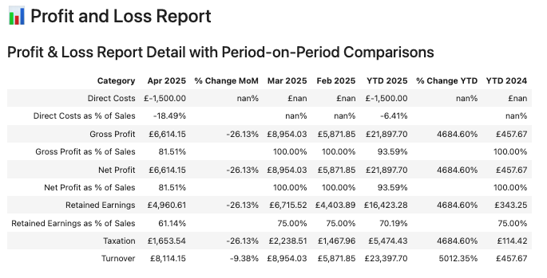

# Automated Financial Analysis with BigQuery and VertexAI

This project demonstrates how to automate Profit & Loss (P&L) financial report analysis using Google Cloud technologies. The system extracts financial data from Xero via BigQuery, performs detailed analysis, and generates professional reports with meaningful insights using generative AI.



## 📋 Project Context

This project uses real financial data from **Demo Company Ltd**, a fictional technology consulting firm dedicated to software development and integration services for enterprise clients. While the data structure and analysis flow are real, specific financial values have been modified to maintain confidentiality.

### Data Source

The company uses **Xero** as its primary accounting system. Financial data is automatically synced to Google BigQuery using the Fivetran connector, which:

1. Extracts accounting data from Xero daily
2. Loads this data into structured tables in BigQuery
3. Applies transformations using dbt packages to generate analytical tables

The main data used comes from the following tables:
- `xero__profit_and_loss_report`: Contains P&L records at the monthly and account level
- `xero__general_ledger`: Contains detailed journal entries that can be analyzed to identify specific transactions


## 🚀 Key Features

- **Complete automation** of financial analysis, from data extraction to report generation
- **Detailed analysis** of trends, significant changes, and important transactions
- **AI-generated insights** providing interpretations and practical recommendations
- **Professional visualization** of financial data with period-to-period comparisons
- **Historical storage** of reports in BigQuery for tracking over time
- **Daily updates** through scheduled workflows to ensure information is always current

## 🔍 The Analysis Process

The system performs the following analysis steps to generate valuable insights:

1. **Extraction of Xero data**: Retrieval of complete financial data from BigQuery
2. **Category summarization**: Aggregation of data at the account category level (Revenue, Direct Costs, Overheads)
3. **Period-to-period change analysis**:
   - Current month vs previous month (MoM)
   - Year-to-date vs previous year-to-date (YTD)
4. **Account group breakdown**: Detailed analysis within each category to identify specific areas of change
5. **Trend analysis**: Identification of groups with significant growth or decline
6. **Significant transaction detection**: Identification of individual transactions causing major changes
7. **Generative AI analysis**: Generation of comments and recommendations based on processed data
8. **Results storage**: Saving the complete report in BigQuery for historical reference

## 🧠 Generative AI Integration

The heart of the system is the integration with **Google Vertex AI (Gemini)** which:

1. Receives the already processed and structured financial data
2. Analyzes patterns, trends, and anomalies in the data
3. Generates a detailed report with key observations about financial performance
4. Provides specific recommendations based on the data

The prompt used for generating the analysis is carefully designed to:
- Focus on the most relevant financial KPIs
- Highlight significant changes in revenue and expenses
- Provide context about important transactions
- Suggest practical actions to improve financial performance

This prompt can be easily customized to adapt to the specific needs of different teams or departments.

## 📊 Example Output

The system generates two main elements:

### 1. Financial Data Table


This table shows:
- Financial results by category
- Month-to-month and year-to-year comparisons
- Percentages and variations for easy interpretation

### 2. AI-Generated Analysis and Commentary


The analysis includes:
- Executive summary of financial results
- Revenue trend analysis
- Interpretation of changes in direct costs
- Observations on overhead expenses
- Actionable recommendations

## 🔄 Workflow Automation

The system is fully automated to run daily through:

1. **Cloud Scheduler**: Triggers the notebook execution at 06:00 AM
2. **Vertex AI Workbench**: Runs the complete analysis notebook
3. **BigQuery**: Stores the generated report in a historical table
4. **Data Studio**: Visualizes the most recent results in an accessible dashboard

This automation ensures that financial teams and executives always have access to updated information and relevant analysis without manual intervention.

## 🛠️ Technologies Used

- **Google BigQuery**: For storage and querying of financial data
- **Google Vertex AI (Gemini)**: For generating analysis and natural language interpretations
- **Langchain**: For structuring and optimizing AI requests
- **Pandas**: For data processing and manipulation
- **Python**: As the base language for system development
- **Cloud Scheduler**: For automating daily execution
- **Vertex AI Workbench**: For automatic notebook execution

## 🔧 Setup and Usage

### Prerequisites

- Google Cloud Platform account with BigQuery and Vertex AI enabled
- Python 3.7+ with the following libraries:
  - `pandas`
  - `google-cloud-bigquery`
  - `google-cloud-aiplatform`
  - `langchain`

### Installation

1. Clone this repository
2. Install dependencies: `pip install -r requirements.txt`
3. Configure your Google Cloud credentials
4. Update the `PROJECT_ID`, `DATASET_ID`, and `LOCATION` variables in the notebook

### Execution

To run the analysis manually:

```python
# Start the complete analysis process
python main.py
```

To configure automatic execution:

1. Upload the notebook to Vertex AI Workbench
2. Configure a Cloud Scheduler job that triggers the notebook execution
3. Set up the necessary permissions to access BigQuery and Vertex AI

### Customization

To adapt this project to your needs:
- Modify the SQL queries in `get_pl_data` to match your data structure
- Adjust the `generate_analysis_prompt` function to focus the analysis on specific areas
- Update the HTML generation in `generate_report_html` to change the report layout
- Customize the final report format according to your organization's requirements

## 💡 Business Value

This system provides several key benefits for any organization:

- **Time savings**: Reduces hours of manual analysis to minutes of automated processing
- **Consistent analysis**: Ensures all financial reports are analyzed with the same depth and criteria
- **Early problem detection**: Proactively identifies concerning trends and anomalous transactions
- **Improved decision making**: Provides data-driven recommendations to optimize financial management
- **Complete history**: Maintains a record of all financial reports and analyses for future reference

## 🔮 Future Developments

The project has potential to expand in several directions:

### 1. Financial Forecasting
Implement predictive models that generate financial projections based on historical data and identified trends. These forecasts could be automatically rebalanced as new actual data arrives.

### 2. Alert System
Develop an alert system that notifies financial teams when anomalies or significant deviations from budgets or projections are detected.

### 3. Multidimensional Analysis
Expand the analysis to include other dimensions such as departments, projects, or clients, allowing for more granular analysis of financial performance.

### 4. Interactive Dashboard
Create an interactive dashboard that allows users to explore financial data and access customized analyses on demand.

### 5. Budget Planning Integration
Connect the system with budget planning tools to automatically compare actual results vs. budgeted and generate variance analyses.

## 🤝 Contributions

Contributions are welcome! If you have ideas to improve this project, feel free to:
1. Fork the repository
2. Create a new branch for your feature
3. Submit a pull request

---

For more information or to report issues, please open an issue in this repository.
